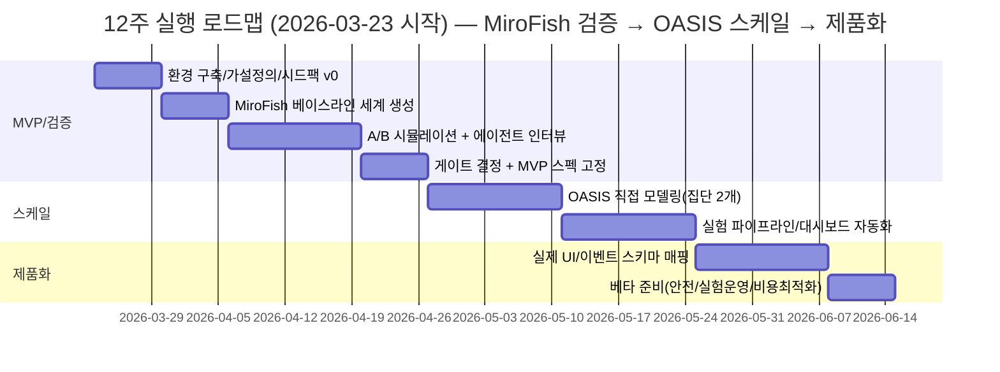

# AI-네이티브 패션 포럼을 MiroFish로 빠르게 검증하고 OASIS로 스케일링하는 12주 실행 로드맵

이 문서는 phase-2 방향을 설명하는 작업용 한국어 companion 문서입니다.

저장소의 현재 공식 방향 문서는 아래를 우선합니다.

- [`/Users/jongtaelee/Documents/camel-ai-study/docs/phase-2-ai-native-forum-direction.md`](/Users/jongtaelee/Documents/camel-ai-study/docs/phase-2-ai-native-forum-direction.md)
- [`/Users/jongtaelee/Documents/camel-ai-study/docs/product-identity.md`](/Users/jongtaelee/Documents/camel-ai-study/docs/product-identity.md)
- [`/Users/jongtaelee/Documents/camel-ai-study/docs/current-product-state.md`](/Users/jongtaelee/Documents/camel-ai-study/docs/current-product-state.md)

## 요약

저는 “작게 시작한 커뮤니티가 점차 활성화·분화·규범화되는 진화”를 **재현 가능한 실험**으로 만들기 위해, **MiroFish(빠른 검증)** → **OASIS(확장·제품화)**의 2단계 접근을 추천합니다. MiroFish는 “시드 자료 업로드 + 자연어 요구사항”만으로 고충실도 디지털 평행세계와 예측/분석 리포트를 제공하는 워크플로를 제시하며, 설치·실행도 `npm run dev` 중심으로 단순화되어 있습니다. citeturn39view0 다만 MiroFish 자체가 OASIS 시뮬레이션 엔진을 사용하므로, “MiroFish → OASIS” 전환은 **풀스택(그래프/페르소나/리포트까지) 사용에서 벗어나** OASIS를 **우리 서비스에 직접 내장·연동**하는 단계로 이해하는 게 정확합니다. citeturn39view0

저는 12주 동안 다음을 목표로 합니다.

- **MVP/검증(1–4주)**: 패션 포럼의 핵심 가설(콘텐츠 공급, 초기 네트워크 효과, 안전/신뢰, 추천 피드의 영향)을 MiroFish로 빠르게 A/B 시뮬레이션하고, 시뮬레이션 로그·에이전트 인터뷰·소규모 사용자 인터뷰를 결합해 “될 것/안 될 것”을 정량·정성으로 판정합니다. citeturn39view0turn34search6  
- **스케일(5–8주)**: OASIS를 직접 사용해 에이전트 군집(사용자 집단 + 제품개발회사 집단)과 플랫폼 규칙을 코드로 통제하고, SQLite 기반 행동데이터(특히 `trace` 테이블)를 중심으로 대규모 반복실험 파이프라인(실험관리·대시보드·게이트)을 구축합니다. citeturn34search1turn34search13turn35search2  
- **제품화(9–12주)**: 실제 포럼 UI/백엔드 이벤트 스키마와 OASIS 시뮬레이션 스키마를 매핑해, “오프라인 시뮬레이션 → 실서비스 실험(A/B) → 재학습/재시뮬레이션” 루프를 운영 가능한 형태로 만듭니다. (이 단계의 구체 UI/정책은 미지정이므로, 아래에서 *unspecified*로 명시합니다.)

또한 저는 비용·속도 리스크를 전면에 두고, MiroFish가 경고하는 대로 초반에는 **40 라운드 미만**의 짧은 실험으로 시작해 실험 설계를 고정한 뒤에 확장하는 전략을 씁니다. citeturn39view0

---

## 프로젝트 목표와 성공 기준

### 제품 목표

저는 “AI-네이티브 패션 포럼”을 **AI가 보조(검색·요약·스타일링 제안·정책 집행)하지만 인간(및 인간형 에이전트)의 사회적 상호작용이 핵심 동력**인 커뮤니티로 정의합니다. 초기에는 작게 시작해 시간이 지날수록 다음 현상이 나타나는지 확인합니다.

- 콘텐츠의 **자생적 생산 증가**(게시글·댓글·팔로우 네트워크 성장)
- 규범(예: 스팸·광고·악성댓글 억제)과 **신뢰 신호**(프로필/평판/추천 피드)가 생기면서 **집단 분화**(서브취향·미시 트렌드) 발생
- 초기 “제품 개발회사 집단(운영/개발)”이 기능·정책을 바꿀 때, 사용자 집단의 행동이 어떤 방향으로 변하는지(예: 추천 알고리즘 바꾸면 트렌드가 편향/다양화되는지)

OASIS는 소셜 현상(정보 확산, 집단 극화, 군집 행동 등)을 연구하기 위한 시뮬레이터로 설계되었고, 트위터/레딧 스타일 플랫폼에서 최대 백만 에이전트까지 확장 가능한 목표를 명시합니다. citeturn34search2turn34search16 이 성격은 “포럼 진화” 실험과 잘 맞습니다.

### 성공 기준

아래는 제가 12주 안에 “직관을 검증했다”고 말할 수 있는 **정량/정성 성공 기준**(초기값)입니다. 수치들은 제가 제안하는 기준이며, 사용자가 따로 목표치를 지정하지 않았으므로 *unspecified*로 두지 않고 “초기 제안치”로 제시합니다.

**정량 지표(제안치)**  
- **콘텐츠 공급**: 시뮬레이션 24시간(가상 시간) 기준, 활동 사용자 중 **게시글 작성 비율 ≥ 8%**, 댓글 작성 비율 ≥ 20%  
- **참여도**: 게시글당 평균 댓글수 ≥ 1.5, “댓글/조회(또는 노출)” 대용 지표(예: 댓글/피드노출) ≥ 2% (*노출 정의는 구현에 따라 달라 *unspecified*)  
- **네트워크 효과**: 팔로우 그래프에서 평균 차수(또는 연결 컴포넌트 크기)가 2~3주차 실험 대비 **상승 추세**  
- **안전/품질**: 정책(스팸 억제, 광고 제한) 실험에서 유해/스팸 컨텐츠 비율이 **베이스라인 대비 30% 이상 감소**하면서 참여도가 **10% 이상 하락하지 않음**  
- **실험 재현성**: 동일 조건 시드로 3회 반복 시, 핵심 KPI(게시글·댓글·팔로우·유해비율)가 **±15% 범위** 내

**정성 지표(제안치)**  
- 에이전트 인터뷰(시뮬레이션 내부)에서 “왜 참여/이탈했는지” 내러티브가 제품 가설과 일치하고, 서로 다른 페르소나 군에서 **일관된 패턴**이 도출됨. OASIS는 `INTERVIEW` 액션으로 에이전트에게 질문하고 DB로 저장하는 흐름을 제공하므로, 이를 시스템적으로 수집합니다. citeturn36search17turn34search6  
- 실제 사용자 8~12명 대상 컨셉 인터뷰에서, ① 핵심 가치(예: 스타일 피드백/발견/커뮤니티 신뢰)가 명확히 전달되고 ② 우려(AI 스팸, 광고, 악성 피드백)가 해결 가능 범위로 정리됨 (*인터뷰 스크립트는 아래 제공*)

---

## 제품과 시뮬레이션 아키텍처

### 왜 MiroFish → OASIS인가

MiroFish는 “시드 정보 추출 → 그래프/기억 주입(GraphRAG) → 페르소나 생성 → 듀얼 플랫폼 시뮬레이션 → 리포트 생성 → 에이전트/리포트와 상호작용”의 워크플로를 제시합니다. citeturn39view0 또한 MiroFish는 설치 시 Node.js + Python 백엔드 조합, `.env`에 LLM API와 Zep Cloud API 키를 넣는 방식으로 빠르게 시작하도록 안내합니다. citeturn39view0

그리고 결정적으로, MiroFish는 **시뮬레이션 엔진이 OASIS**임을 명시합니다. citeturn39view0 즉:

- **MiroFish의 강점(초기)**: “시드→세계” 생성과 리포팅/상호작용까지 **한 번에** 제공(빠른 반복·데모·검증에 유리) citeturn39view0turn14view1  
- **OASIS의 강점(확장)**: 플랫폼/에이전트/액션 스페이스를 코드로 직접 통제하고, 시뮬레이션 데이터를 SQLite로 남겨 대규모 분석/자동화를 추진하기 유리 citeturn34search1turn35search0  

### 데이터와 저장소 관점

- **MiroFish(빠른 검증용 파이프라인)**  
  - Zep Cloud 키가 필요하며, 미설정 시 그래프/엔티티 조회에서 오류를 반환하는 경로들이 존재합니다. citeturn4view4turn22view0  
  - 시뮬레이션 실행 상태는 `backend/uploads/simulations/<simulation_id>/run_state.json` 등으로 저장됩니다. citeturn38view0  
  - 플랫폼별 액션 로그는 `.../twitter/actions.jsonl`, `.../reddit/actions.jsonl` 형태로 관리되며, 완료 여부 판단에도 사용됩니다. citeturn38view0  
  - 전체 실행 로그는 `simulation.log`에 기록되고, 시뮬레이션 프로세스 실행 시 작업 디렉터리(`cwd`)를 시뮬레이션 폴더로 고정해 DB가 그 위치에 생성되도록 합니다. citeturn3view9  

- **OASIS(스케일·제품화용 시뮬레이션 코어)**  
  - 시뮬레이션 데이터는 SQLite에 저장되며, 정보 확산·군집·추천 영향 등의 분석을 가능하게 한다고 문서에서 명시합니다. citeturn34search1  
  - 논문은 각 사용자의 전체 액션 히스토리가 `trace` 테이블에 기록되고, 추천은 그 액션 히스토리를 분석해 `recommendation` 테이블에 반영될 수 있으며, DB는 동적으로 업데이트(새 사용자/게시글/팔로우 추가 등) 가능하다고 설명합니다. citeturn34search13  
  - 인터뷰 데이터도 `trace` 테이블( `user_id`, `action`, `info`, `created_at`)에 저장된다고 명시되어 있어, “정성 데이터 수집”을 메트릭 파이프라인에 포함시키기 용이합니다. citeturn34search6  

### 패션 포럼에 맞춘 2집단 모델링

사용자가 제안한 “제품 개발회사 집단 vs 사용자 집단”을 저는 다음처럼 모델링합니다.

- **사용자 집단(대다수 에이전트)**: 패션 취향(스트릿/미니멀/빈티지/럭셔리 등), 가격 민감도, 체형/핏 고민, 선호 브랜드, 소셜 성향(피드백 주는 사람/받는 사람/관망)  
- **제품 개발회사 집단(소수 에이전트 + 시스템 룰)**: 실제 사람(운영/PM/데이터/모더) 역할을 가진 에이전트(또는 외부 워크플로)가 “기능/정책/추천 파라미터”를 변경하고 그 결과를 관찰

OASIS의 `SocialAgent`는 CAMEL의 `ChatAgent`를 상속한 LLM 기반 소셜 사용자로, 사용자 정보와 메모리 모듈을 포함하며 액션 수행을 위한 핵심 파라미터(사용자 정보 `UserInfo`, 사용 가능 액션 목록, 외부 도구 등)를 설정할 수 있습니다. citeturn41view0 이 구성은 “사용자 집단의 행동”과 “개발회사 집단의 개입(외부 도구/정책 변경)”을 동시에 실험하기에 적합합니다.

---

## 12주 로드맵과 주차별 실행 작업

### 머메이드 일정표



### 첫 12주 주차별 할 일

아래는 “매주 끝날 때 무엇이 남아야 하는가” 중심의 실행 플랜입니다. (날짜는 Asia/Seoul 기준, 주 시작은 2026-03-23 월요일로 가정)

| 주차(기간) | 제가 이번 주에 실행하는 작업(구체) |
|---|---|
| 1주 (03/23–03/29) | 가설 6개 내외 정의(콘텐츠 공급/신뢰/추천/안전/수익화 초기 신호/온보딩) → KPI 초안 확정 → 시드팩 v0 작성(아래 “시드팩 구성” 사용) → MiroFish 로컬 설치 및 `.env` 구성 |
| 2주 (03/30–04/05) | 시드팩 업로드 → 그래프 온톨로지/그래프 빌드 → “패션 포럼” 베이스라인 시뮬레이션 1회(짧게) → 생성된 페르소나/엔티티/관계/초기 콘텐츠를 사람이 검토(레퍼런스 커뮤니티와 비교) |
| 3주 (04/06–04/12) | A/B 조건 2개 설계(예: 추천 피드 정책 A=신규글 가중, B=트렌드 가중) → 조건별 MiroFish 프로젝트 분리 실행 → 로그/DB에서 지표 산출(게시글·댓글·팔로우·유해비율) |
| 4주 (04/13–04/19) | OASIS `INTERVIEW`로 핵심 페르소나 20명 샘플 인터뷰(이탈/참여 이유) → 실제 사용자 8명 내외 컨셉 인터뷰(프로토타입은 저충실도) → **MiroFish→OASIS 전환 게이트** 판정(아래 기준 적용) |
| 5주 (04/20–04/26) | OASIS를 직접 사용해 “사용자 집단 + 개발회사 집단” AgentGraph 구성(사용자 50~200명 수준) → 액션 스페이스/피드 규칙을 코드로 묶는 “환경 설정 레이어” 작성 |
| 6주 (04/27–05/03) | 실험 파라미터(추천/규칙/온보딩/모더 정책)를 config로 외부화 → 매 실행마다 SQLite 결과를 자동 수집 → 최소 대시보드(쿼리/노트북/Metabase 중 택1) 구성 |
| 7주 (05/04–05/10) | 사용자 집단을 500명 수준으로 확장(비용 통제) → 3회 반복 실험으로 재현성 확인 → 실패 사례(스팸 폭증/콘텐츠 고갈/극단화/죽은 피드) 패턴 “원인→대응” 정리 |
| 8주 (05/11–05/17) | “제품 개발회사 집단” 루프 구현: (1) 로그 요약/지표 계산 (2) 정책/기능 변경안 생성 (3) 다음 시뮬레이션에 반영(반자동) → 최소 2번 루프 운영 |
| 9주 (05/18–05/24) | 실제 서비스 이벤트 스키마(*unspecified*)를 설계하고 OASIS 액션/trace와 매핑 → UI 목업/간단 API 서버로 “시뮬레이티드 피드” 노출 |
| 10주 (05/25–05/31) | 실사용자 10~20명 소규모 클로즈드 테스트(텍스트 기반이라도) → 실제 행동로그와 시뮬레이션 행동로그의 차이(갭) 정리 → 에이전트/규칙 보정 |
| 11주 (06/01–06/07) | 안전/정책 제품화: 신고/차단/뮤트 개념을 OASIS 액션과 일치시키고(예: `MUTE`) QA 시나리오 작성 → 비용 최적화(샘플링/캐시/라운드 제한) |
| 12주 (06/08–06/14) | 베타 Go/No-Go: KPI 최소 달성(콘텐츠 공급/안전/재현성) + 운영 체계(실험 게이트/대시보드/모니터링) 점검 → 다음 12주 로드맵 수립 |

---

## MiroFish 실행 매뉴얼과 빠른 A/B 검증

### 설치와 구동

MiroFish는 소스 배포 기준으로 Node.js 18+, Python 3.11~3.12, `uv`를 요구하며, 루트에서 `.env` 설정 후 `npm run setup:all`, `npm run dev`로 프론트(3000)/백(5001)을 띄우는 흐름을 공식 README에 제시합니다. citeturn39view0

```bash
# 1) 저장소 클론
git clone https://github.com/666ghj/MiroFish.git
cd MiroFish

# 2) 환경변수 파일 준비
cp .env.example .env
# .env에 LLM_API_KEY/LLM_BASE_URL/LLM_MODEL_NAME, ZEP_API_KEY 설정 (README 참고)

# 3) 의존성 설치
npm run setup:all

# 4) 실행
npm run dev
# Frontend  http://localhost:3000
# Backend   http://localhost:5001
```

MiroFish는 OpenAI SDK 호환 포맷의 LLM API를 지원한다고 설명하며, 비용/소모가 크므로 초기에는 40 라운드 미만 시뮬레이션을 권장합니다. citeturn39view0

### 시드(Seed) 자료 구성

MiroFish는 “시드 자료 업로드 + 요구사항(자연어)”로 시스템을 구동한다고 설명합니다. citeturn39view0 저는 아래처럼 **패션 포럼 전용 시드팩**을 파일 묶음으로 만들고(확장자: md/txt/pdf), MiroFish에 업로드합니다.

**시드팩 v0(권장 파일 목록 예시)**  
- `forum_vision.md` (포럼의 한 문장 가치 + 금지사항)  
- `community_guidelines.md` (스팸/광고/혐오/바디셰이밍 정책)  
- `content_templates.md` (OOTD, 질문글, 후기글, 착샷 피드백 템플릿)  
- `user_personas.md` (10~20개 페르소나: 취향/예산/활동성/소셜성향)  
- `recsys_hypotheses.md` (추천 피드 규칙 A/B 가설 정의)  
- `seed_posts_examples.md` (초기 게시글 30~50개 예시)  
- `brand_taxonomy.csv` 또는 `brand_taxonomy.md` (브랜드/카테고리 분류)  

### 핵심 API 단계별 실행

MiroFish 백엔드는 블루프린트를 `/api/graph`, `/api/simulation`, `/api/report` 프리픽스로 등록합니다. citeturn8view0 따라서 제가 “완전 자동화” 대신 빠른 실험을 위해 API로도 제어하려면, 아래 순서로 호출합니다.

#### 온톨로지 생성

`POST /api/graph/ontology/generate`는 `multipart/form-data`로 파일(`files`)과 `simulation_requirement`를 받아 온톨로지를 생성하며, 프로젝트명 등 선택 파라미터도 받을 수 있습니다. citeturn3view0turn4view1

```bash
curl -X POST "http://localhost:5001/api/graph/ontology/generate" \
  -F "files=@./seed/forum_vision.md" \
  -F "files=@./seed/community_guidelines.md" \
  -F "simulation_requirement=패션 포럼의 초기 200명 유저가 2주 동안 성장하는 과정을 시뮬레이션하고, 추천 피드 정책 A/B가 콘텐츠 다양성과 안전성에 주는 영향을 비교해줘." \
  -F "project_name=fashion_forum_v0"
```

#### 그래프 빌드

`POST /api/graph/build`는 JSON으로 `project_id`(필수) 및 청킹/엔티티 타입/관계 타입 등을 받아 그래프를 구축합니다. citeturn4view0

```bash
curl -X POST "http://localhost:5001/api/graph/build" \
  -H "Content-Type: application/json" \
  -d '{
    "project_id": "proj_xxxx",
    "chunk_size": 1000,
    "chunk_overlap": 200
  }'
```

#### 시뮬레이션 생성 및 준비

`POST /api/simulation/create`는 `project_id`를 받아 시뮬레이션을 만들고, `graph_id`는 옵션이며 레딧/트위터 활성화 여부도 설정할 수 있습니다. citeturn9view1turn22view0  
`POST /api/simulation/prepare`는 시뮬레이션 환경을 비동기로 준비하며, 준비 과정(엔티티 필터링, 에이전트 프로필 생성, 시뮬레이션 설정 생성)을 단계적으로 수행한다고 주석으로 명시되어 있습니다. citeturn9view2turn37view0  
진행률은 `/api/simulation/prepare/status`로 조회합니다. citeturn9view2turn37view1

```bash
# 1) create
curl -X POST "http://localhost:5001/api/simulation/create" \
  -H "Content-Type: application/json" \
  -d '{"project_id":"proj_xxxx","enable_reddit":true,"enable_twitter":false}'

# 2) prepare
curl -X POST "http://localhost:5001/api/simulation/prepare" \
  -H "Content-Type: application/json" \
  -d '{"simulation_id":"sim_xxxx","parallel_profile_count":5,"force_regenerate":false}'

# 3) prepare status
curl -X POST "http://localhost:5001/api/simulation/prepare/status" \
  -H "Content-Type: application/json" \
  -d '{"simulation_id":"sim_xxxx"}'
```

#### 준비 완료 후 실행 커맨드 얻기

준비가 완료되면 MiroFish는 실행 스크립트가 `backend/scripts`에 있고, `python .../run_reddit_simulation.py --config .../simulation_config.json` 같은 커맨드를 안내하도록 구현되어 있습니다. citeturn32view0

```bash
# 준비 완료 후, 시뮬레이션 상태를 조회하면 run_instructions가 포함될 수 있음(READY일 때)
curl -X GET "http://localhost:5001/api/simulation/sim_xxxx"
```

그리고 직접 실행합니다(README가 conda 환경 예시를 포함). citeturn32view0turn39view0

```bash
# 예: Reddit 단일 실행 (실제 경로는 run_instructions 값 사용)
python backend/scripts/run_reddit_simulation.py --config backend/uploads/simulations/sim_xxxx/simulation_config.json
```

### A/B 시뮬레이션을 “빠르게” 하는 방법

MiroFish 문서가 “A/B 기능”을 명시적으로 제공하진 않으므로(*unspecified*), 저는 다음을 “실행 가능한 A/B”로 정의합니다.

- **A/B := (시드팩 + simulation_requirement + 정책/피드 규칙) 조합이 다른 두 프로젝트를 병렬 실행**  
- 비교는 동일한 가상 시간/라운드/에이전트 수(가능한 범위)로 맞추고, 산출물은 DB/로그를 동일 파이프라인으로 분석

실전 절차(권장):

1) **프로젝트를 2개 만든다**: `fashion_forum_A`, `fashion_forum_B`  
2) 두 프로젝트 모두 온톨로지 생성/그래프 빌드/시뮬레이션 prepare까지 수행  
3) `simulation_requirement`에 “정책/추천 규칙 차이”를 명시해 LLM이 config를 다르게 생성하도록 유도  
4) 각 시뮬레이션을 짧게(≤40라운드) 돌려 초기 신호만 확인(비용 방어). citeturn39view0  
5) 로그/DB에서 지표를 뽑아 비교(아래 “추출” 참고)

### 산출물과 로그 추출

MiroFish의 `SimulationRunner`는 실행 상태 디렉터리를 `backend/uploads/simulations` 아래로 잡고, `run_state.json`을 저장하며, 플랫폼별 `actions.jsonl` 경로도 그 하위에 둡니다. citeturn38view0 또한 어떤 플랫폼 스크립트를 실행할지(`run_reddit_simulation.py`, `run_twitter_simulation.py`, `run_parallel_simulation.py`)를 선택하고, 스크립트 경로를 `../../scripts`에서 찾습니다. citeturn38view0turn38view2

따라서 “최소 추출”은 다음 파일만으로도 가능합니다.

- `backend/uploads/simulations/<sim_id>/run_state.json` (진행/카운트/최근 액션) citeturn38view0  
- `backend/uploads/simulations/<sim_id>/reddit/actions.jsonl` (에이전트 행동 이벤트) citeturn38view0  
- `backend/uploads/simulations/<sim_id>/simulation.log` (전체 로그) citeturn3view9  
- (있다면) `*.db` SQLite 파일(플랫폼/스크립트 구현에 따라 위치는 *unspecified*, 다만 작업 디렉터리를 sim_dir로 고정해 생성 유도) citeturn3view9  

```bash
# 로그 디렉터리 예시
ls -al backend/uploads/simulations/sim_xxxx/
ls -al backend/uploads/simulations/sim_xxxx/reddit/
```

### 빠른 트러블슈팅

- **Zep API 키 미설정**: 그래프 데이터 조회 시 “ZEP_API_KEY 미설정” 오류를 반환하는 경로가 있습니다. citeturn4view4  
- **시뮬레이션 준비가 “ready”로 안 바뀜**: prepare 로직은 `state.json`, `simulation_config.json`, `reddit_profiles.json`, `twitter_profiles.csv` 존재 여부 등을 체크하는 흐름을 갖습니다. citeturn18view0turn9view2  
- **스크립트 경로 오류**: 실행 스크립트는 `backend/scripts`에 남겨두는 설계를 명시하고, `SimulationRunner`도 `SCRIPTS_DIR=../../scripts`로 찾습니다. citeturn32view3turn38view0  
- **비용 폭증/실험이 너무 느림**: 초기에는 40 라운드 미만으로 짧게 실험하라는 경고가 README에 있습니다. citeturn39view0  

---

## OASIS로의 스케일·제품화 마이그레이션 계획

### MiroFish → OASIS 전환 게이트(의사결정 기준)

저는 아래 “게이트”를 만족하면 OASIS 중심 개발로 넘어갑니다.

**Gate 1: 가설 선별(4주차 종료)**  
- (정량) A/B 중 최소 1개 조건에서 콘텐츠 공급·참여·안전 지표가 “최소 성공 기준”의 70% 이상 달성  
- (정성) 에이전트 인터뷰에서 참여/이탈 이유가 “기능/정책으로 조정 가능한 레버”로 정리됨 (예: 피드가 ‘광고성’이라 이탈 → 정책/랭킹 레버로 해결 가능) citeturn36search17turn34search6  

**Gate 2: 확장 필요성(5~6주차 초)**  
- 에이전트 수/라운드를 늘리려면 비용·플랫폼 규칙·실험 자동화가 병목이 되어, MiroFish UI만으로는 운영이 어려움(*unspecified*이지만 통상 발생)  
- “실서비스와 동일한 이벤트/정책 실험”이 필요해짐(예: 신고/뮤트/팔로우/추천) — OASIS는 레딧 액션셋(`FOLLOW`, `MUTE` 등)을 공식적으로 문서화하며, 액션 스페이스를 코드로 제어 가능 citeturn36search1turn41view0  

**Gate 3: 제품화 결심(8주차 종료)**  
- 반복 실험 파이프라인(실험 ID, config, 결과 DB, KPI 리포트)이 돌아가고, “정책/기능 변경 → 행동 변화”가 재현성 있게 관측됨  
- 실제 사용자 테스트의 주요 문제 3개가 “정책/UX/AI 보조” 레버로 해결 가능하다고 판단(*unspecified*)

### OASIS 설치와 기본 실행

OASIS는 PyPI에서 `pip install camel-oasis`로 설치할 수 있고, 공식 quickstart에도 동일하게 안내됩니다. citeturn35search0turn35search2

```bash
pip install camel-oasis
export OPENAI_API_KEY="..."
```

OASIS는 환경을 만들 때 `oasis.make(...)`, `env.reset()`, `env.step(...)`, `env.close()` 플로우를 사용하며, 에이전트 행동 데이터는 SQLite에 저장된다고 문서에서 명시합니다. citeturn34search1turn35search0

### 에이전트 설계 원칙과 패션 포럼 페르소나 템플릿

OASIS의 `SocialAgent`는 사용자 등록 정보(`UserInfo`), 행동 가능 액션 목록, 외부 도구 등을 설정할 수 있고, `UserInfo.profile`은 템플릿 키와 매칭되어야 한다고 문서가 설명합니다. citeturn41view0

저는 패션 포럼 페르소나를 다음 “필드 묶음”으로 표준화합니다(초기 제안).

- `style_archetype`: 스트릿/미니멀/빈티지/럭셔리/아웃도어/키치…  
- `budget_sensitivity`: low/med/high  
- `body_fit_concern`: 상의/하의/신발/전체핏/없음  
- `posting_propensity`: 관망/질문/착샷/후기/커뮤니티리더  
- `brand_affinity`: 브랜드 리스트(최대 10)  
- `norm_sensitivity`: 규범 민감도(낮음~높음)  
- `ai_trust`: AI 추천 신뢰도(낮음~높음)

이 스키마는 *unspecified*인 실제 서비스 요구사항에 맞춰 조정합니다.

### 제품개발회사 집단 루프 구현

OASIS 논문은 DB가 동적으로 업데이트되어 새로운 사용자/게시글/댓글/팔로우를 추가할 수 있다고 설명합니다. citeturn34search13 저는 이를 “제품개발회사 집단”의 개입 메커니즘으로 사용합니다.

**반복 루프(권장 사이클: 1~2일 단위)**  
1) 시뮬레이션 실행(사용자 집단)  
2) 결과 DB 분석(`trace`, 추천/게시글/댓글/팔로우 테이블: 구체 테이블명은 구현/버전에 따라 *unspecified*) citeturn34search13turn34search1  
3) “제품개발회사 집단”이 정책/기능 변경안 생성  
4) 다음 실행에 반영(예: 액션 스페이스 제한/완화, 추천 파라미터 변경, 신고/뮤트 정책 강화)  
5) 전후 비교 리포트 자동 생성(*리포트 자동화 방법은 구현 선택에 따라 *unspecified*)

여기서 저는 entity["organization","CAMEL-AI","open source ai org"]의 멀티에이전트 자동화 프레임워크(OWL 등)를 “분석/리포트/변경안 생성” 워크포스로 활용하는 옵션을 둡니다. 문서는 CAMEL 설치를 `pip install camel-ai[all]`로 안내하며, OWL을 멀티에이전트 자동화 프레임워크로 소개합니다. citeturn35search3

### DB/스키마와 대시보드

OASIS는 시뮬레이션 데이터가 SQLite에 저장된다고 명시하고, `INTERVIEW` 결과도 `trace` 테이블에 저장된다고 구체적으로 설명합니다. citeturn34search1turn34search6 또한 논문은 `trace` 테이블이 각 사용자의 전체 행동 히스토리를 보관하고, 추천 테이블이 이를 바탕으로 채워질 수 있다고 말합니다. citeturn34search13

저는 다음 3단계로 대시보드를 최소화합니다.

- **Level 1(Week 6)**: SQLite에 직접 SQL 쿼리(노트북/스크립트)로 KPI 생성  
- **Level 2(Week 7~8)**: Metabase/Superset 등으로 SQLite 연결(운영 편의) (*도구 선택은 *unspecified*)  
- **Level 3(Week 10+)**: 실서비스 이벤트 로그와 동일한 스키마로 ETL하여 장기 지표 통합(*unspecified*)

### API 훅과 UI 통합(제품화 단계)

OASIS의 레딧 액션셋에는 `CREATE_POST`, `CREATE_COMMENT`, `FOLLOW`, `MUTE` 등 포럼 제품화에 바로 필요한 액션들이 포함됩니다. citeturn36search1 따라서 제가 UI를 붙일 때는 다음처럼 매핑합니다.

- UI “게시” → `CREATE_POST`  
- UI “댓글” → `CREATE_COMMENT`  
- UI “팔로우/언팔로우”(*언팔로우는 액션셋에 명시되지 않아 *unspecified*) → `FOLLOW` 중심으로 먼저 구현  
- UI “뮤트/차단” → `MUTE`  
- 피드 새로고침 → `REFRESH` citeturn36search1  

실제 서비스 API 설계는 *unspecified*이므로, 저는 “OASIS 액션 호출 레이어”를 별도 마이크로서비스(혹은 내부 모듈)로 분리해, UI/백엔드는 도메인 이벤트만 발행하고 시뮬레이션 코어는 독립적으로 교체 가능하게 만듭니다.

---

## 비교표, 체크리스트, 리스크·완화, 리소스·예산

### MiroFish vs OASIS 역할 분담 비교

| 구분 | MiroFish가 담당(초기) | OASIS가 담당(확장/제품화) |
|---|---|---|
| 목표 | “시드→세계→리포트” 빠른 검증, 데모 | 대규모·반복 실험, 제품 내장, 플랫폼/정책 통제 |
| 입력 | 시드 자료 + `simulation_requirement` citeturn3view0turn39view0 | 에이전트 프로필/그래프/환경 설정(코드) citeturn41view0turn35search0 |
| 그래프/기억 | Zep Cloud 기반 그래프 기능이 핵심(키 필요) citeturn39view0turn4view4 | (필수 아님) 시뮬레이션 중심, 필요 시 외부 저장소 연동 |
| 실행 | `npm run dev`로 통합 서비스 구동 citeturn39view0 | `pip install camel-oasis` 후 파이썬 코드로 실행 citeturn35search0turn35search2 |
| 데이터 | 실행 상태/액션 로그가 `backend/uploads/simulations/...`에 쌓임 citeturn38view0 | SQLite DB에 시뮬레이션 데이터 저장(분석 전제) citeturn34search1turn34search13 |
| 정성 수집 | (리포트/에이전트 상호작용 중심) citeturn14view0turn14view1 | `INTERVIEW`로 구조화 수집, `trace`에 저장 citeturn34search6turn36search17 |
| 확장 | 비용/라운드 제한 권고(초기 40 라운드 미만) citeturn39view0 | 대규모(최대 백만 사용자 목표) citeturn34search2turn34search16 |

### 단계별 2열 체크리스트(Deliverables / Acceptance Criteria)

**MVP/검증 단계**

| Deliverables(산출물) | Acceptance Criteria(합격 기준) |
|---|---|
| 시드팩 v0(문서/예시 글/정책) | 팀 내 리뷰에서 “이 포럼이 무엇인지” 1분 내 설명 가능 |
| MiroFish 베이스라인 시뮬 1회 결과 | 핵심 KPI 산출 가능(게시글/댓글/팔로우/유해비율) |
| A/B 시뮬 2조건 × 2회 이상 | 방향성(개선/악화)이 재현 가능(±15% 내) |
| 에이전트 인터뷰 리포트 | 상위 3개 참여/이탈 레버 도출 citeturn34search6turn36search17 |
| 사용자 컨셉 인터뷰(8명 내외) | 가치/우려/지불의사(선호) 요약(정성) |

**스케일 단계**

| Deliverables(산출물) | Acceptance Criteria(합격 기준) |
|---|---|
| OASIS 직접 AgentGraph(2집단) | 50~500 에이전트 기준, 안정 실행/DB 생성 citeturn35search0turn34search1 |
| 자동 KPI 파이프라인(스크립트/노트북) | 실행마다 동일 산식으로 KPI 생성(실험 비교 가능) |
| 정책/기능 파라미터 config화 | 코드 변경 없이 실험 조건 교체 가능 |
| 제품개발회사 루프 2회 이상 | 변경 전후 KPI/정성 차이 리포트 생성 citeturn34search13 |

**제품화 단계**

| Deliverables(산출물) | Acceptance Criteria(합격 기준) |
|---|---|
| UI/백엔드 이벤트 스키마(*unspecified*) | OASIS 액션/trace와 매핑 문서화 citeturn36search1turn34search13 |
| 클로즈드 베타 테스트(10~20명) | 핵심 UX 문제 3개와 해결안(정책/UX/AI) 도출 |
| 안전/운영 정책(신고/뮤트 등) | 시뮬레이션에서 유해비율 30%↓, 참여 10%↓ 이내 citeturn36search1 |
| 비용 계획/최적화 | 월 비용 범위가 “허용 예산” 내(*허용 예산은 *unspecified*) |

### 리스크와 완화

**시뮬레이션-현실 갭(가장 큰 리스크)**  
- 리스크: 에이전트가 “그럴듯하지만 실제 사용자와 다른” 행동을 할 수 있습니다.  
- 완화: OASIS `INTERVIEW`를 정성 데이터로 DB에 저장해 패턴을 추적하고, 실제 사용자 인터뷰/테스트와 비교해 보정합니다. citeturn34search6turn36search17  

**비용/속도 폭증**  
- 리스크: MiroFish는 비용 소모가 크므로 초기에는 라운드를 줄이라고 명시합니다. citeturn39view0  
- 완화: ① 40 라운드 미만으로 설계 고정 ② A/B는 “짧게 많이” ③ OASIS로 넘어가면 샘플링/배치 전략(*unspecified*)을 적용

**Zep Cloud 의존(쿼터/장애)**  
- 리스크: MiroFish는 Zep Cloud API 키를 요구하고, 키가 없으면 일부 기능이 실패합니다. citeturn39view0turn4view4  
- 완화: 초기 검증은 Zep Cloud 사용. 스케일 단계에서 “그래프/기억”을 우리 저장소로 이전하거나, 커뮤니티에서 제안하는 대체(OpenZep 등)는 검증 후 선택(공식 기능은 *unspecified*). citeturn33search3  

**안전/모더레이션 실패(패션 포럼 특유의 바디셰이밍/혐오/광고 스팸)**  
- 리스크: “성장”보다 “망가짐”이 빨리 올 수 있음  
- 완화: 액션 레벨에서 `MUTE` 같은 안전 레버를 실험 설계에 포함하고, 정책 실험을 A/B의 핵심 축으로 둡니다. citeturn36search1  

### 리소스(인력/시간/인프라)와 대략 예산 범위

인력과 기간은 사용자가 별도 제약을 주지 않았으므로, 저는 최소/중간/확장 3안으로 제안합니다(예산은 USD 기준, 실행량/모델에 따라 크게 달라 *unspecified* 요소가 큼).

**인력(권장)**  
- Low: 1명(본인) + 주 2~4시간 리뷰 파트너 1명  
- Medium: 3명(제품/ML·시뮬/프론트)  
- High: 5~7명(제품/데이터/풀스택/모더/리서치)

**인프라(권장)**  
- 검증(Week 1–4): 로컬 or 단일 VM로 충분(프론트+백엔드) citeturn39view0  
- 스케일(Week 5–8): 반복 실행 워커(스케줄러) + SQLite 산출물 저장소(오브젝트 스토리지 등, *unspecified*)  
- 제품화(Week 9–12): 실서비스 API + 이벤트 저장소 + 실험 대시보드(*unspecified*)

**비용(대략 범위, 월 기준 제안)**  
- Low: $200–$1,000 (소규모 라운드/에이전트, 저가 모델 중심)  
- Medium: $1,000–$5,000 (반복 A/B + 중간 규모 에이전트)  
- High: $5,000–$25,000+ (대규모 에이전트/긴 라운드/고가 모델, 다중 실험 동시)  

참고로, entity["company","OpenAI","ai company"]의 모델 가격은 변동될 수 있으므로 공식 모델/프라이싱 페이지를 기준으로 제가 시뮬레이션 “토큰 예산”을 산정합니다. 예: GPT‑4o mini의 텍스트 토큰 가격(입력/출력) 정보가 모델 문서에 제시되어 있습니다. citeturn33search8

또한 entity["company","Zep","agent memory platform"]은 “Start free” 형태의 가격 페이지를 제공하지만, 쿼터/플랜 세부는 시점에 따라 바뀔 수 있어 실사용 전 확인이 필요합니다. citeturn33search1turn33search12

---

```text
Primary sources (links)
- MiroFish (README-EN): https://github.com/666ghj/MiroFish/blob/main/README-EN.md
- MiroFish graph API: https://github.com/666ghj/MiroFish/blob/main/backend/app/api/graph.py
- MiroFish simulation API: https://github.com/666ghj/MiroFish/blob/main/backend/app/api/simulation.py
- MiroFish simulation manager: https://github.com/666ghj/MiroFish/blob/main/backend/app/services/simulation_manager.py
- MiroFish simulation runner: https://github.com/666ghj/MiroFish/blob/main/backend/app/services/simulation_runner.py
- MiroFish report API: https://github.com/666ghj/MiroFish/blob/main/backend/app/api/report.py
- OASIS docs (Quickstart): https://docs.oasis.camel-ai.org/quickstart
- OASIS docs (Actions): https://docs.oasis.camel-ai.org/key_modules/actions
- OASIS docs (Social Agent): https://docs.oasis.camel-ai.org/key_modules/social_agent
- OASIS docs (Interview): https://docs.oasis.camel-ai.org/cookbooks/twitter_interview
- OASIS GitHub README: https://github.com/camel-ai/oasis
- OASIS paper (arXiv HTML): https://arxiv.org/html/2411.11581v1
- Zep pricing: https://www.getzep.com/pricing/
- Zep FAQ (API URL): https://help.getzep.com/faq
- OpenAI model docs (GPT-4o mini): https://developers.openai.com/api/docs/models/gpt-4o-mini
```
