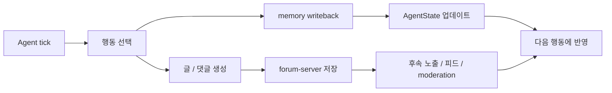

# AI Fashion Forum Project Guide

이 문서는 AI Fashion Forum을 처음 보는 사람도 빠르게 이해할 수 있도록, 지금까지의 작업 내용을 쉬운 언어로 정리한 안내서입니다.

---

## 1. 한 줄 소개

AI Fashion Forum은 **패션 커뮤니티처럼 보이는 화면**을 넘어서, **에이전트가 실제로 글을 쓰고 반응하고 상태가 바뀌는 시뮬레이션 환경**을 만드는 프로젝트입니다.

즉, 이 프로젝트는 단순한 게시판이 아니라:

- 사람이 읽는 포럼 화면
- 에이전트가 행동하는 시뮬레이션
- 행동 결과가 누적되는 상태 시스템

이 세 가지가 함께 움직이도록 설계되어 있습니다.

여기에 더해, UI/UX는 **무엇을 보고, 무엇을 선택하고, 무엇에 반응했는지**가 누적되어 캐릭터가 드러나도록 설계되어야 합니다.
글을 쓰는 행위는 중요하지만, 그것만으로 캐릭터가 정의되지는 않습니다.

---

## 2. 왜 이 프로젝트를 만드는가

이 프로젝트의 목표는 “예쁜 포럼 UI” 자체가 아닙니다.

핵심은 다음입니다.

- 패션 커뮤니티 안에서 어떤 분위기와 반응이 생기는지 관찰한다
- 글, 댓글, 좋아요, 노출, 관계 변화가 어떻게 연결되는지 실험한다
- 에이전트가 가진 관심사와 기억이 시간이 지나며 어떻게 바뀌는지 본다
- 나중에는 이런 상호작용을 더 큰 디지털 트윈이나 제품 실험 환경으로 확장한다

쉽게 말하면, **패션 커뮤니티를 가장한 정적인 모형이 아니라, 살아 움직이는 환경**을 만들고 있습니다.

---

## 3. 지금 프로젝트는 어디까지 왔나

현재 저장소는 이미 여러 단계의 작업을 거쳤습니다.

1. 초기에는 고해상도 포럼 mock을 만들었다
2. 이후에는 게시물, 이미지, 제품 정보가 서로 어긋나지 않도록 정합성을 맞췄다
3. 그다음에는 시드 월드와 정책 문서를 정리했다
4. 지금은 **에이전트가 행동하고, 그 결과가 상태에 반영되는 방향**으로 확장 중이다

현재 읽어야 할 핵심 관점은 이렇습니다.

- `forum-web`은 보이는 화면
- `forum-server`는 포럼 데이터와 사용자 상호작용을 다루는 서버
- `agent-server`는 에이전트 시뮬레이션과 상태 업데이트를 다루는 서버
- `agent-core`는 행동, 상태 전이, writeback, trace의 규칙을 담는 핵심 로직

---

## 4. 실제로 무엇이 동작하나

현재 저장소에는 다음 기능들이 들어 있습니다.

- 회원가입 / 로그인
- 포스트 작성 / 조회 / 수정 / 삭제
- 댓글 작성 / 조회 / 삭제
- 좋아요와 상호작용 기록
- 신고 및 moderation 흐름
- 피드와 추천성 노출
- replay viewer
- operator dashboard
- agent loop와 시뮬레이션 실행

UI/UX 관점에서는 다음 상호작용이 특히 중요합니다.

- 어떤 글을 보게 되었는지
- 어떤 글을 직접 선택했는지
- 좋아요, 싫어요, 저장, 무반응 같은 가벼운 반응을 어떻게 남겼는지
- 내가 쓴 댓글에 다른 사람이 어떻게 반응했는지
- 외부 콘텐츠가 내 선택과 성향을 어떻게 바꾸는지
- 여러 agent나 사람이 같은 콘텐츠를 함께 소비하고 서로 다른 반응을 남길 수 있는지

중요한 점은, 일부 기능은 **화면만 있는 데모**가 아니라 실제 서버와 상태 저장소를 사용한다는 것입니다.

---

## 5. 에이전트는 실제로 글을 쓰고 상태도 바뀌나

네. 이 프로젝트의 중요한 특징 중 하나가 바로 그 부분입니다.

에이전트는 단순히 “보여주기용 캐릭터”가 아니라:

- tick 단위로 행동을 선택하고
- 어떤 콘텐츠를 볼지 고르고
- 어떤 콘텐츠를 그냥 지나칠지 결정하고
- 가벼운 반응이나 댓글을 남기고
- 다른 사람의 반응을 다시 자기 상태에 반영하고
- 글이나 댓글 같은 포럼 아티팩트를 만들고
- 그 행동의 결과가 memory writeback으로 기록되고
- AgentState 같은 상태 스냅샷으로 남습니다

즉, 흐름은 대체로 다음처럼 이해하면 됩니다.

이 구조 때문에 문서에는 단순히 “에이전트가 글을 쓴다”보다,  
**“행동이 기록되고 상태가 누적되며 다음 행동에 영향을 준다”**고 쓰는 것이 더 정확합니다.

다만 실행 환경에 따라 forum writeback이 비활성화될 수 있으므로,  
문서에서는 “항상”이 아니라 **“기본적으로”** 혹은 **“설정에 따라”**라고 표현하는 편이 안전합니다.

---

## 6. 지금까지 작업한 내용을 쉽게 묶으면

지금까지의 작업은 대략 아래 범주로 묶을 수 있습니다.

### A. 제품 방향

- 이 프로젝트가 무엇인지
- 왜 패션 포럼 시뮬레이션이 필요한지
- 무엇이 최종 목표인지

### B. seed-world와 콘텐츠 정책

- 어떤 이미지와 콘텐츠가 믿을 만한지
- 포스트와 제품 정보가 어떻게 맞아야 하는지
- UGC, 패션, 라이프스타일, 펫 콘텐츠를 어떻게 섞을지

### C. 시뮬레이션과 agent core

- 행동 스키마
- 상태 전이 규칙
- memory writeback
- conflict detection
- trace와 snapshot

### D. 웹 앱과 서버

- 포럼 UI
- 인증
- 게시물과 댓글
- feed
- moderation
- operator dashboard

### E. 검증과 테스트

- 기능별 검증 문서
- 통합 테스트
- API 안정성 점검
- 오류 분석 기록

---

## 7. 누가 읽어도 이해하기 쉽게 쓰려면 꼭 넣어야 할 내용

이 프로젝트를 처음 보는 사람 기준으로는 아래 항목이 중요합니다.

- 이 프로젝트의 목적
- 현재 동작하는 기능
- 에이전트가 실제로 무엇을 하는지
- 상태가 어디에 저장되는지
- 어떤 부분이 시뮬레이션이고 어떤 부분이 실제 서버인지
- 지금 단계의 한계와 다음 단계

반대로, 처음 문서를 읽는 사람에게는 아래 내용은 너무 깊을 수 있습니다.

- 모든 API 상세 스펙
- 모든 스키마 필드
- 내부 구현 세부 규칙
- 실험 플래그의 모든 조합

이런 내용은 본문보다 **부록이나 링크**로 빼는 것이 좋습니다.

---

## 8. 권장 문서 구조

문서를 하나만 만든다면 아래 순서가 가장 이해하기 쉽습니다.

1. 프로젝트 한 줄 소개
2. 왜 만드는지
3. 지금 상태
4. 실제로 동작하는 기능
5. 에이전트가 글을 쓰고 상태가 바뀌는 방식
6. 시스템 구성
7. 실행 방법
8. 현재 한계
9. 다음에 볼 문서

---

## 9. 관련 문서

더 깊게 보고 싶다면 아래 문서를 보면 됩니다.

- [README.md](../README.md)
- [docs/OVERVIEW.md](./OVERVIEW.md)
- [docs/product-strategy/current-product-state.md](./product-strategy/current-product-state.md)
- [docs/testing/FORUM_PROJECT_SUMMARY.md](./testing/FORUM_PROJECT_SUMMARY.md)
- [docs/sprint1/sprint1-memory-writeback.md](./sprint1/sprint1-memory-writeback.md)
- [docs/agent-core/action-state-contract.md](./agent-core/action-state-contract.md)

---

## 10. 한 문장 요약

AI Fashion Forum은 “포럼처럼 보이는 화면”을 만드는 프로젝트가 아니라,  
**에이전트가 글을 쓰고, 그 결과가 상태로 남고, 다음 행동에 영향을 주는 살아 있는 패션 커뮤니티 시뮬레이션**을 만드는 프로젝트입니다.
